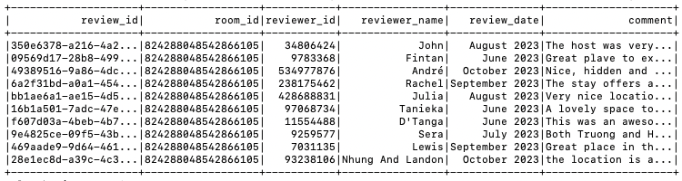
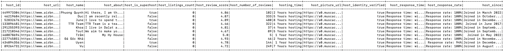
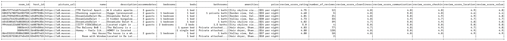

# Airbnb WebScraper
## Overview
This project scrapes data from Airbnb Website and stores data in data lake house hosted by HDFS. The code will walkthrough all of listing rooms which are searching's results and scrape all of information available on the room's page (e.g room name, room description, price, review scores, etc.)

## Tools & Technology
- [Selenium](https://www.selenium.dev/) - is an open-source browser automation tools and libraries mainly used for scraping in this project.
- [Apache Spark](https://spark.apache.org/) - distributed processing system used for transform and load data to data lakehouse
- [Apache Hadoop](https://hadoop.apache.org/) - distributed storage system to store delta table
- [Delta Lake](https://delta.io/) - open-source storage layer run on top of HDFS in this project to create transaction log for parquet data.
- [Docker](https://www.docker.com/) - used for containerizing application

## Workflow
The project's workflow described as below:


Selenium will load the main page, input several query in the search query specified in **main.py** (You're able to modify it as your preferences). Then it click the search button. It will scraping through all of listings available on all pages of the searching's result for the room's information, host's information and all reviews of the rooms. Then Spark transform data to dataframe and store data to data lakehouse built on HDFS. Applications used in this project containerized by Docker.

## Demo
Demo for scraping data task:


## ER Diagram
The data scraped will have ER Diagram as below:


## Schema
This is the schema described results as tables:


## Data Example
Examples of data scraped data:
room_reviews:



host_detail:



room_detail:



## **Setup & Deployment**

### Prerequisites
- Docker

### Setup
I prepared few scripts to setup and start the project automatically. In order to setup this project, the following steps are required for the project to be successfully executed.

* Firstly, you need to gain permission for shell scripts by using the following command:
    ```
    chmod +x *.sh
    ```

* Then run the following command to setup required images and containers:
    ```
    ./setup.sh
    ```
    This function is downloading/buidling required images, then creating containers for services used in this project. </br>
    
* In order to start processing streaming and batch events, use this script:
    ```
    ./start-scraping.sh
    ```
    This script start scraping data from airbnb and store data into HDFS as format of delta table.

* To shut down the project, use this command:
    ```
    ./shutdown.sh
    ```

* Running services can be directly accessible at following these sites:
    * Spark Web UI: http://localhost:8080
    * HDFS Web UI: http://localhost:9870 (You can observe scraped data in this directory /spark-warehouse/{table} on HDFS)